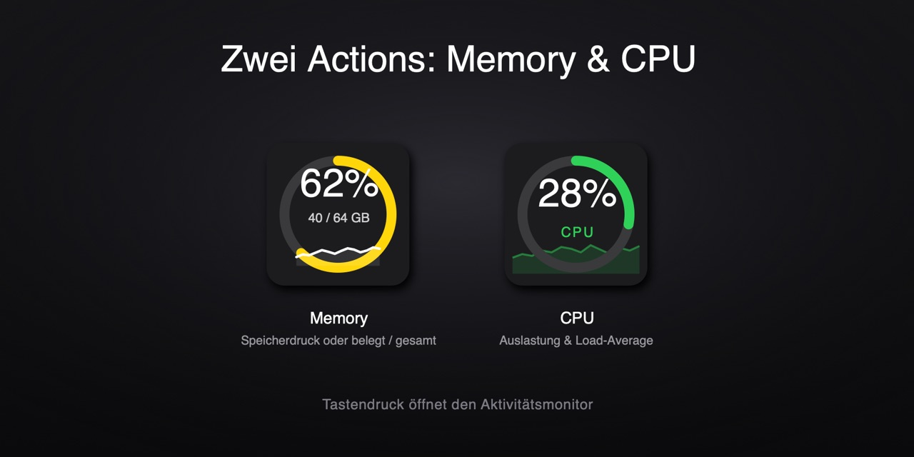
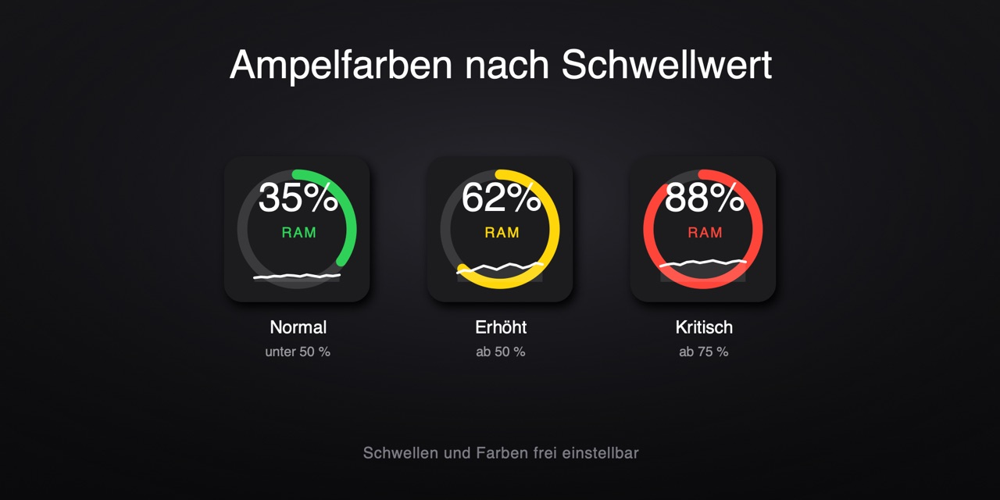
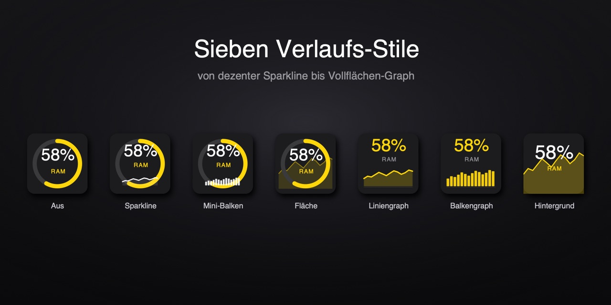

# System Usage

Stream Deck Plugin für macOS mit zwei Actions, die **RAM** und **CPU** als
farbige Prozentanzeige auf einer Taste darstellen.

- Zwei Actions: **Memory** und **CPU**
- Ringanzeige mit Prozentwert, Ampelfarbe **grün → gelb → rot** je nach Schwellwert
- Optionale zweite Zeile: **GB** (belegt / gesamt) bei Memory, **Load-Average** bei CPU
- **Verlaufsgraph** in 6 Stilen (oder aus): Sparkline, Mini-Balken, Fläche, Liniengraph, Balkengraph, Hintergrund-Graph
- Memory zusätzlich umschaltbar: **Speicherdruck** oder **belegt/gesamt**
- **Tastendruck** öffnet den Aktivitätsmonitor
- Aktualisiert sich automatisch (Standard: alle 2 Sekunden)

## Vorschau

**Zwei Actions – Memory & CPU**

**Ampelfarben nach Schwellwert**

**Sieben Verlaufs-Stile**

## Messung

Alle Werte werden ohne Helper-Programm gelesen:

| Action | Wert | Quelle |
| --- | --- | --- |
| Memory – Speicherdruck | `100 − kern.memorystatus_level` | `sysctl` |
| Memory – belegt/gesamt | `(active + wired + komprimiert) / hw.memsize` | `vm_stat` + `sysctl` |
| CPU – Auslastung | Idle/Total-Delta über das Intervall | `os.cpus()` |
| CPU – Load-Average | 1 / 5 / 15 Minuten | `os.loadavg()` |

> **Warum nicht `os.freemem()`?** macOS hält kaum „freien" Speicher vor (es cached
> aggressiv), daher meldet Node dort fast immer ~98 % belegt – unbrauchbar.

## Konfiguration (Property Inspector)

**Gemeinsam (beide Actions):**

| Einstellung | Standard | Beschreibung |
| --- | --- | --- |
| Graph | Sparkline | Verlaufs-Darstellung (s. u.) |
| Label | RAM / CPU | Text unter der Zahl (entfällt bei aktiver zweiter Zeile) |
| Refresh (sec) | 2 | Aktualisierungsintervall (min. 1 s) |
| On press → Open Activity Monitor | an | Tastendruck öffnet den Aktivitätsmonitor |
| Yellow / Red from (%) | 50/75 (RAM) · 60/85 (CPU) | Ampel-Schwellen |
| Green / Yellow / Red | Apple-Systemfarben | Frei wählbare Ampelfarben |

**Nur Memory:** Metrik (Speicherdruck / belegt-gesamt), GB-Zeile an/aus.
**Nur CPU:** Load-Average-Zeile an/aus.

### Graph-Stile

| Stil | Darstellung |
| --- | --- |
| Aus | nur Ring + Prozent |
| Sparkline (klein) | Ring + dünne Verlaufslinie unten |
| Mini-Balken (klein) | Ring + kleines Balken-Histogramm unten |
| Fläche (mit Ring) | Ring + Verlauf als gefüllte Hintergrundfläche |
| Liniengraph (groß) | kein Ring, große farbige %, prominenter Linien-Chart |
| Balkengraph (groß) | kein Ring, große farbige %, Balken-/Equalizer-Chart |
| Hintergrund-Graph | Verlauf füllt die ganze Taste, % als Overlay |

Beim Metrikwechsel (Memory) wird der Verlaufsgraph zurückgesetzt.

## Tech

TypeScript · Node.js 20 · Stream Deck SDK v2 · Rollup · macOS-only (`sysctl`, `vm_stat`, `os`)
